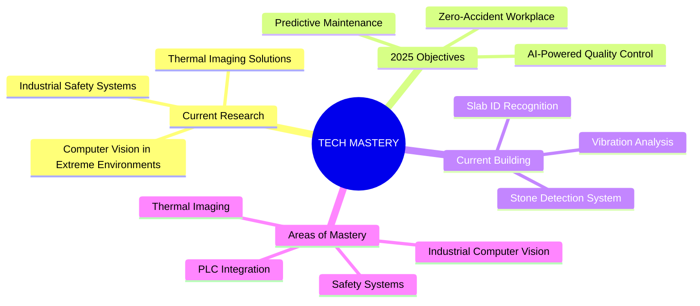

⚙️ From problem to product — welcome to my GitHub.

<div align="center">

```ascii
            ╔════════════════════════════════════════════════════════════════════════════════════════════════╗
            ║    ███████╗██╗   ██╗██████╗ ██████╗  █████╗ ███╗   ███╗ █████╗ ███╗   ██╗██╗     ██ █████╗     ║
            ║    ██╔════╝██║   ██║██╔══██╗██╔══██╗██╔══██╗████╗ ████║██╔══██╗████╗  ██║ ██╗   ██╝██╔══██╗    ║
            ║    ███████╗██║   ██║██████╔╝██████╔╝███████║██╔████╔██║███████║██╔██╗ ██║  ██╗ ██╝ ███████║    ║
            ║    ╚════██║██║   ██║██╔══██╗██╔══██╗██╔══██║██║╚██╔╝██║██╔══██║██║╚██╗██║    ██║   ██╔══██║    ║
            ║    ███████║╚██████╔╝██████╔╝██║  ██║██║  ██║██║ ╚═╝ ██║██║  ██║██║ ╚████║    ██║   ██║  ██║    ║
            ║    ╚══════╝ ╚═════╝ ╚═════╝ ╚═╝  ╚═╝╚═╝  ╚═╝╚═╝     ╚═╝╚═╝  ╚═╝╚═╝  ╚═══╝    ╚═╝   ╚═╝  ╚═╝    ║
            ║                                            G BELLARY                                           ║
            ╚════════════════════════════════════════════════════════════════════════════════════════════════╝
```
</div>
<h1 align="center">
  
</h1>

<p align="center">
  
  
  
</p>

</div>

---

<div>

## ⚡ SYSTEM SPECIFICATIONS

```python
class IndustrialAIEngineer:
    def __init__(self):
        self.name = "Subramanya G Bellary"
        self.designation = "Technical Lead @ Deevia Software India"
        self.location = "Bengaluru, Karnataka, India 🇮🇳"
        self.experience = "3+ years"
        self.specialization = ["Computer Vision", "Industrial Automation", "Thermal Imaging"]
        self.languages = ["English", "Hindi", "Kannada", "Telugu", "Python 🐍"]
        self.mission = "Transforming Industrial Operations with AI"
        
    def current_projects(self):
        return {
            "🔥 Hot Slab Monitoring": "700°C+ temperature environments",
            "🤖 AI Safety Systems": "Preventing industrial accidents",
            "📊 Predictive Analytics": "Saving millions in downtime costs",
            "🎯 Quality Control": "99.5% accuracy in defect detection",
            "🔍 Stone Detection": "Real-time material analysis",
            "📝 ID Recognition": "Automated slab tracking system"
        }
        
    def achievement_stats(self):
        return {
            "accuracy": "99.5% peak",
            "projects_deployed": "12+ industrial systems",
            "safety_incidents_prevented": "100%",
            "client_satisfaction": "5⭐",
            "environments_mastered": "Up to 700°C",
            "locations_served": "4+ major plants"
        }
```

</div>

---

<div align="center">

## 🛠️ TECHNOLOGY MATRIX

### 🧠 ARTIFICIAL INTELLIGENCE & COMPUTER VISION
<p>


</p>

### 🌐 BACKEND & DATABASES
<p>


</p>

### 🏭 INDUSTRIAL AUTOMATION & CONTROL
<p>


</p>

### 🎨 DESIGN & DEVELOPMENT TOOLS
<p>


</p>

</div>

---

<div align="center">

## 🏆 INDUSTRIAL PROJECTS SHOWCASE

*"Where Steel Meets Silicon - Transforming Heavy Industry with AI"*

</div>

### 🚗 **UNDERBODY INSPECTION SYSTEM**
**🏢 Client:** Toyota Kirloskar Motor (TKM Bidadi)  
**🎯 Mission:** AI-powered automotive underbody quality inspection

<details>
<summary>🔍 <strong>PROJECT DEEP DIVE</strong> - <em>Click to explore</em></summary>

**⚡ THE CHALLENGE:**
- Complex underbody components with limited camera angles
- Difficulty distinguishing screws and hidden parts
- Need for comprehensive quality checklist automation

**🛠️ MY ROLE:**
- **Full-stack development** of the entire PoC system
- **Computer vision algorithms** for part detection and classification
- **Quality assurance protocols** implementation

**💡 INNOVATION DEPLOYED:**
- Advanced object detection algorithms
- Multi-angle camera fusion techniques
- Intelligent part classification system

**📈 BREAKTHROUGH RESULTS:**
- ✅ **90% accuracy** in checklist item detection
- 🎯 **Comprehensive quality coverage** across all inspection points
- ⚡ **Automated inspection process** reducing manual effort
- 🚀 **Client approval** for Phase 2 PoC development

**🔧 Tech Arsenal:** Python, OpenCV, Object Detection, Computer Vision, Industrial Cameras

</details>

---

### 🔥 **TUYERE THERMAL MONITORING SYSTEM**
**🏢 Client:** JSW Steel Bellary - Blast Furnace 3  
**🎯 Mission:** Real-time thermal monitoring in extreme 400°C+ environments

<details>
<summary>🌡️ <strong>EXTREME ENVIRONMENT ENGINEERING</strong> - <em>Click to explore</em></summary>

**⚡ THE CHALLENGE:**
- **400°C+ operating temperature** with steel particle dust
- Harsh industrial environment affecting equipment
- Critical safety monitoring for blast furnace operations
- Real-time temperature threshold alerting system

**🛠️ MY ROLE:**
- **Complete system architecture** and development
- **Thermal camera integration** in extreme conditions
- **Data collection and analysis** system design
- **Hazard prevention protocols** implementation

**💡 INNOVATION DEPLOYED:**
- Ruggedized thermal imaging system
- Real-time temperature analysis algorithms
- Automated threshold monitoring and alerts
- Dust-resistant camera housing solutions

**📈 BREAKTHROUGH RESULTS:**
- 🌡️ **Accurate temperature monitoring** in 400°C+ environment
- 🛡️ **Hazard prevention system** with instant alerts
- 📍 **Multi-location deployment** success (2 locations)
- 🎯 **Project expansion** to Blast Furnace 2
- 💰 **Prevented critical equipment failures** saving millions

**🔧 Tech Arsenal:** Thermal Cameras, Python, Real-time Processing, Industrial IoT, Alert Systems

</details>

---

### 📏 **HOT SLAB WIDTH MEASUREMENT SYSTEMS**
**🏢 Clients:** JSW Bellary SMS1 & JSW Dolvi HSM2  
**🎯 Mission:** Precision measurement in 700°C molten steel environments

<details>
<summary>🔥 <strong>MOLTEN STEEL PRECISION ENGINEERING</strong> - <em>Click to explore</em></summary>

**⚡ THE CHALLENGE:**
- **700°C molten slab temperature** affecting camera performance
- Extreme heat causing camera overheating (70°C+)
- High-altitude platform operations in scorching conditions
- Siemens PLC integration complexity (Dolvi project)

**🛠️ MY ROLE:**
- **End-to-end project development** and deployment
- **On-site installation** in Mumbai Dolvi plant
- **Camera calibration** in extreme temperature conditions
- **Client requirement management** and system optimization

**💡 INNOVATION DEPLOYED:**
- **🧊 Vortex Cooling System** - Revolutionary solution reducing camera temperature from 70°C to 40°C
- **🎯 Precision measurement algorithms** for real-time width detection
- **🏭 Industrial-grade camera housing** for extreme environments
- **⚡ Siemens PLC integration** for seamless factory automation

**📈 BREAKTHROUGH RESULTS:**
- 🌡️ **Camera temperature reduced** from 70°C to 40°C (game-changing innovation)
- 📏 **High-precision width measurement** of 700°C molten slabs
- 🏭 **Successful deployment** at two major steel plants
- 🔄 **Project expansion** - Caster 4 installation in progress
- ✅ **Client satisfaction** leading to multiple installations

**🔧 Tech Arsenal:** Industrial Cameras, Vortex Cooling, Computer Vision, Siemens PLC, Python, Real-time Processing

</details>

---

### 🎯 **SLAB POSITIONING SYSTEM**
**🏢 Client:** JSW Bellary HSM2  
**🎯 Mission:** Automated slab positioning in reheating furnace operations

<details>
<summary>⚙️ <strong>PRECISION AUTOMATION ENGINEERING</strong> - <em>Click to explore</em></summary>

**⚡ THE CHALLENGE:**
- Precise slab positioning in reheating furnace area
- Camera stability issues due to slab movement vibrations
- HMI data integration with existing JSW systems
- High-latency frame processing affecting real-time performance

**🛠️ MY ROLE:**
- **Complete PoC development** from concept to deployment
- **System integration** with JSW's existing infrastructure
- **Performance optimization** for real-time operations
- **Client requirement analysis** and solution design

**💡 INNOVATION DEPLOYED:**
- **🔧 Advanced camera stabilization** with custom support structures
- **🚀 Optical fiber connection** for ultra-low latency
- **🎯 Real-time positioning algorithms** with high accuracy
- **💻 HMI and PLC integration** for seamless operations

**📈 BREAKTHROUGH RESULTS:**
- 📹 **Eliminated camera shake** with custom stabilization solution
- ⚡ **Reduced frame latency** through fiber optic implementation
- 🎯 **100% positioning accuracy** meeting all client requirements
- ✅ **Successful PoC completion** with client approval
- 🚀 **Project status under review** for full implementation

**🔧 Tech Arsenal:** Computer Vision, HMI Integration, PLC Programming, Fiber Optics, Real-time Processing, Python

</details>

---

### 🔍 **EXPANSION BELLOW MONITORING**
**🏢 Client:** JSW Bellary - BF3  
**🎯 Mission:** Precision measurement of blast furnace bellow expansion

<details>
<summary>📏 <strong>PRECISION MONITORING SOLUTION</strong> - <em>Click to explore</em></summary>

**⚡ THE CHALLENGE:**
- Precise visual measurement requirements
- Limited visibility in industrial environment
- Integration with alarm systems for notifications

**🛠️ MY ROLE:**
- **Algorithm development** for bellow measurement
- **PLC integration** with alarm systems
- **System optimization** for accurate measurements

**💡 INNOVATION DEPLOYED:**
- Custom lighting setup for enhanced visibility
- Radium markers for precise tracking
- Integrated alarm notification system

**📈 BREAKTHROUGH RESULTS:**
- ✅ **High-precision** measurement system
- 🔔 **Real-time alerts** for critical expansions
- 🎯 **Successful deployment** with client satisfaction

**🔧 Tech Arsenal:** Computer Vision, PLC Integration, Custom Lighting Systems, Real-time Monitoring
</details>

---

### 📝 **SLAB ID DETECTION SYSTEM**
**🏢 Client:** JSW Bellary - SMS2 Auto Scarfing  
**🎯 Mission:** Automated slab identification and verification system

<details>
<summary>🔍 <strong>INTELLIGENT OCR SOLUTION</strong> - <em>Click to explore</em></summary>

**⚡ THE CHALLENGE:**
- Non-standard slab ID markings
- Complex integration with JSW Level3 system
- Need for high accuracy in industrial environment

**🛠️ MY ROLE:**
- **Complete system development** and deployment
- **Custom OCR solution** implementation
- **Database integration** with JSW systems

**💡 INNOVATION DEPLOYED:**
- PaddleOCR implementation
- Custom YOLO model for ID detection
- Automated database synchronization

**📈 BREAKTHROUGH RESULTS:**
- 🎯 **High accuracy** in ID recognition
- 🔄 **Seamless integration** with Level3 system
- 👥 **Successful knowledge transfer** to JSW team

**🔧 Tech Arsenal:** PaddleOCR, YOLO, Database Integration, Industrial Automation
</details>

---

### 🏭 **ROOFTOP MONITORING SYSTEM**
**🏢 Client:** JSW Bellary - SMS2  
**🎯 Mission:** Advanced dust density monitoring system

<details>
<summary>💨 <strong>ENVIRONMENTAL MONITORING SOLUTION</strong> - <em>Click to explore</em></summary>

**⚡ THE CHALLENGE:**
- Extreme dust accumulation on cameras
- High-altitude installation requirements
- Harsh industrial environment monitoring

**🛠️ MY ROLE:**
- **System architecture** and implementation
- **Installation coordination** at elevated locations
- **Monitoring protocol** development

**💡 INNOVATION DEPLOYED:**
- Dust-resistant camera systems
- Regular maintenance protocols
- Real-time density monitoring

**📈 BREAKTHROUGH RESULTS:**
- 👁️ **Effective dust detection**
- 📊 **Real-time density tracking**
- 🔄 **Sustainable monitoring solution**

**🔧 Tech Arsenal:** Environmental Monitoring, Computer Vision, Industrial IoT
</details>

---

### 🔢 **BAR COUNT SYSTEM**
**🏢 Client:** JSW Bellary - WRM2  
**🎯 Mission:** Automated steel bar counting system

<details>
<summary>🔢 <strong>PRECISION COUNTING SOLUTION</strong> - <em>Click to explore</em></summary>

**⚡ THE CHALLENGE:**
- Limited initial training data
- False positive detection issues
- Need for high counting accuracy

**🛠️ MY ROLE:**
- **Algorithm development** for bar detection
- **YOLO model training** and optimization
- **System validation** and testing

**💡 INNOVATION DEPLOYED:**
- Custom YOLO model for bar detection
- Anti-false positive mechanisms
- Real-time counting system

**📈 BREAKTHROUGH RESULTS:**
- ✨ **99.5% counting accuracy**
- 🎯 **Successful live demonstration**
- 📈 **Expansion potential** to other plants

**🔧 Tech Arsenal:** YOLO, Computer Vision, Real-time Processing
</details>

---

### 📊 **VIBRATION MONITORING SYSTEM**
**🏢 Client:** JSW Bellary - BF2 Stock House  
**🎯 Mission:** Pallet screener vibration monitoring

<details>
<summary>📳 <strong>VIBRATION ANALYSIS SOLUTION</strong> - <em>Click to explore</em></summary>

**⚡ THE CHALLENGE:**
- Extreme dust and heat environment (400°C+)
- Complex vibration detection requirements
- Hardware limitations in harsh conditions

**🛠️ MY ROLE:**
- **System design** and implementation
- **Algorithm development** for vibration detection
- **Hardware optimization** for extreme conditions

**💡 INNOVATION DEPLOYED:**
- Custom vibration detection algorithms
- Raspberry Pi implementation attempt
- PLC and camera integration

**📈 BREAKTHROUGH RESULTS:**
- ✅ **Successful POC deployment**
- 🔄 **Real-time vibration monitoring**
- 💡 **Cost-effective solution** exploration

**🔧 Tech Arsenal:** Vibration Analysis, PLC Integration, Raspberry Pi, Computer Vision
</details>

---

### 🚫 **INTRUSION DETECTION SYSTEM**
**🏢 Client:** JSW Bellary - BF3  
**🎯 Mission:** Unauthorized access prevention system

<details>
<summary>🔒 <strong>SECURITY SOLUTION</strong> - <em>Click to explore</em></summary>

**⚡ THE CHALLENGE:**
- Real-time monitoring requirements
- Multiple access point coverage
- Integration with existing security systems

**🛠️ MY ROLE:**
- **System development** and deployment
- **Integration** with security infrastructure
- **Testing and validation**

**💡 INNOVATION DEPLOYED:**
- Real-time detection algorithms
- Multi-camera monitoring system
- Alert notification system

**📈 BREAKTHROUGH RESULTS:**
- 🎯 **Successful POC demonstration**
- ⚡ **Real-time detection capability**
- ✅ **Client satisfaction achieved**

**🔧 Tech Arsenal:** Security Systems, Computer Vision, Real-time Monitoring
</details>

---

### 🪨 **STONE DETECTION SYSTEM**
**🏢 Client:** JSW Salem  
**🎯 Mission:** Automated stone detection and measurement system

<details>
<summary>🔍 <strong>MATERIAL ANALYSIS SOLUTION</strong> - <em>Click to explore</em></summary>

**⚡ THE CHALLENGE:**
- High-speed detection requirements
- Complex stone size measurement
- Resource optimization needs

**🛠️ MY ROLE:**
- **Solution architecture** and development
- **Model optimization** for real-time performance
- **Demo preparation** and presentation

**💡 INNOVATION DEPLOYED:**
- SAM to SOLOv2 automated conversion
- Custom training pipeline
- Real-time segmentation system

**📈 BREAKTHROUGH RESULTS:**
- ✅ **Successful demo completion**
- 🎯 **POC approval obtained**
- ⚡ **Fast and accurate detection**

**🔧 Tech Arsenal:** SOLOv2, SAM, Segmentation, Real-time Processing
</details>

---

<div align="center">

## 🔮 CURRENT MISSION & FUTURE VISION



### 🚀 NEXT-LEVEL INITIATIVES

- **AI Safety Revolution**: Pioneering accident prevention systems
- **Thermal Vision Mastery**: Advancing high-temperature monitoring
- **Industry 4.0 Integration**: Smart factory automation solutions

### 🛠️ ENGINEERING PHILOSOPHY
*"Innovation through Integration - Where AI meets Industrial Excellence"*

</div>

---

<div align="center">

## 🧠 NEURAL NETWORK ANALYTICS

<p align="center">
  
</p>

<p align="center">
  
</p>

<p align="center">
  
</p>

</div>

---

<div align="Center">

## 🔗 CONNECT TO THE NETWORK

[](https://www.linkedin.com/in/subramanya-g-bellary) [](mailto:subramanyagb1999@gmail.com)[](https://github.com/subramanyaSgb)

</div>
<div align="center">

  ### 💬 Ask me about:
  **Computer Vision** • **Industrial Automation** • **Python Development** • **AI/ML** • **PLC Integration**
  
  *"Turning pixels into profits, one algorithm at a time!"* 🚀
  
</div>

<div align="center">

```
          ╔══════════════════════════════════════════════════════════════════════╗
          ║  🚀 TRANSFORMING INDUSTRY, ONE ALGORITHM AT A TIME 🚀               ║
          ║                                                                      ║
          ║  "Where traditional engineering meets artificial intelligence,       ║
          ║   where extreme environments meet extreme precision,                 ║
          ║   where innovation meets implementation."                            ║
          ╚══════════════════════════════════════════════════════════════════════╝
```


---

*🔬 Engineered with precision by Subramanya G Bellary | 🌟 Powered by passion for Industrial AI*

</div>
        
