# 👋 Hi there, I'm Subramanya G Bellary!

<div align="center">
  
  [](https://git.io/typing-svg)
  
  
  
</div>

---

## 🚀 About Me

```python
class SubramanyaBellary:
    def __init__(self):
        self.name = "Subramanya G Bellary"
        self.role = "Software Engineer @ Deevia Software"
        self.location = "Bangalore, India 🇮🇳"
        self.languages = ["Python", "English", "Hindi", "Kannada", "Telugu"]
        self.passion = "Building AI-powered industrial solutions"
        self.hogwarts_house = "Gryffindor 🦁"
        
    def current_work(self):
        return [
            "🔥 Developing computer vision systems for steel industry",
            "🤖 Building AI-powered safety & monitoring solutions", 
            "⚡ Integrating PLCs with modern ML algorithms",
            "📊 Creating real-time industrial process monitoring"
        ]
        
    def fun_fact(self):
        return "I turn thermal cameras and computer vision into profit-saving solutions! 💰"
```

---

## 🛠️ Tech Arsenal

<div align="center">

### 🧠 AI & Computer Vision


### 🌐 Backend & Databases  


### 🔧 Industrial & Automation


### 🎨 Design & Tools


</div>

---

## 🏆 Featured Projects & Achievements

<div align="center">

### 🔥 **Industrial AI Solutions** 

</div>

| 🎯 **Project** | 💡 **Impact** | 🛠️ **Tech Stack** |
|---|---|---|
| **Slab Positioning System** | Reduced processing time & increased daily output | YOLOv2, PLC, FastAPI, PostgreSQL |
| **Vibration Monitoring System** | Prevented production losses with 99.9% uptime | Raspberry Pi, Computer Vision, PLC |
| **Intrusion Detection System** | Enhanced workplace safety, prevented incidents | YOLO, OpenCV, PLC Integration |
| **Hot Slab Width Measurement** | Ensured consistent product quality | Real-time CV, Industrial Cameras |
| **Thermal Monitoring System** | Prevented downtime, improved profitability | Thermal Cameras, AI Analytics |

<div align="center">
  
  ### 📊 **By the Numbers**
  
  🏭 **6+ Industrial Projects** | 🤖 **3+ AI Systems Deployed** | 💰 **Cost Savings Achieved** | ⚡ **Zero Downtime Solutions**
  
</div>

---

## 📈 GitHub Analytics

<div align="center">
  
  
</div>

<div align="center">
  
</div>

---

## 🌟 What I'm Up To

```mermaid
graph LR
    A[🔍 Exploring] --> B[Advanced Computer Vision]
    A --> C[Industrial IoT]
    A --> D[Edge AI Solutions]
    
    E[🚀 Building] --> F[Portfolio Website]
    E --> G[Open Source Projects]
    E --> H[Tech Blog]
    
    I[📚 Learning] --> J[MLOps & Deployment]
    I --> K[Cloud Platforms]
    I --> L[Advanced PLCs]
```

<div align="center">



</div>

- 🔭 Currently working on **AI-powered industrial monitoring systems**
- 🌱 Learning **MLOps, Docker, and Cloud Deployment**
- 👯 Looking to collaborate on **Open Source Computer Vision projects**
- 💡 Passionate about **turning AI research into real-world solutions**
- 🎯 Goal: **Building the next generation of smart factories**

---

## 🤝 Let's Connect!

<div align="center">
  
  [](https://linkedin.com/in/subramanyagbellary)
  [](mailto:subramanyagbellary@gmail.com)
  [](https://github.com/subramanyaSgb)
  
  ### 💬 Ask me about:
  **Computer Vision** • **Industrial Automation** • **Python Development** • **AI/ML** • **PLC Integration**
  
  *"Turning pixels into profits, one algorithm at a time!"* 🚀
  
</div>

---

<div align="center">
  
  <!--### 🌟 Show Some Love!
  
  **If you find my work interesting, consider starring ⭐ some repositories!**-->
  
  
  
  ---
  
  *Made with ❤️ and lots of ☕ by Subramanya*
  
</div>
